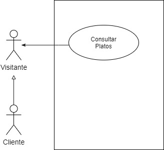
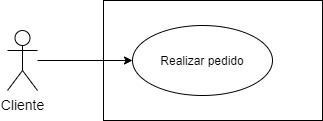
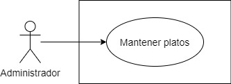
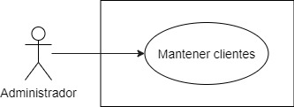

## Equipo 14
- Ángel Manuel Bonilla Huesca
- Aury Josué Almazán Guzmán
- Darwin Jiménez
- Wilber Aldair Alegria Mendez

## Descripción del Proyecto

Planteamos desarrollar un sistema de delivery para restaurantes, que controle la publicación de platillos, venta y entrega de los mismos.

## Alcance

Para este módulo del curso, la API va a cumplir con las siguientes funcionalidades:
- Los clientes deben poder consultar los diferentes platillos que hay en el sistema
- Los clientes deben poder realizar pedidos
- Mostrar la lista de platillos, especialidades y platillo del día, así como la información correspondiente a cada uno de estos
- CRUD de clientes
- CRUD de platillos

## Lista de entidades
- Plato
    - Informa a los clientes que platos están disponibles, así como su tiempo de preparación y costo.
    - Contiene los ingredientes y la receta de cada plato

- Cliente
    - Puede consultar platos
    - Contiene los datos del cliente

- Pedido
    - Agrupa los platillos que el cliente solicita.
    - Calcula el tiempo de demora y el costo del pedido

- Receta
    - Informa los ingredientes y  su cantidad de un platillo

## Historias de usuario y casos de uso
- Como cliente o visitante de DeliveryApp quiero ver todos los platillos que hay en el sistema para poder realizar un pedido

  

 - Como cliente de DeliveryApp quiero realizar un pedido para solicitar los platillos que me agraden
 
 

  

- Como cliente de DeliveryApp quiero registrarme para realizar un pedido

 

  

- Como administrador de DeliveryApp quiero gestionar platillos

  

- Como administrador de DeliveryApp quiero gestionar clientes

  

 
## Descripción técnica
Una muy breve descripción técnica del proyecto en donde se mencionen las tecnologías que se están utilizando y la forma de correrlo.
